quadrealOfEllipticProjectiveQuadrilateralProofPart\_1 

Create a Mathematica function for unique common solution of a pair of compatible quadratic equations.

Substitute values for p1, r1, p2 and r2 from quadratic equations (1) and (2) above to compute the quadreal of quadrilateral.

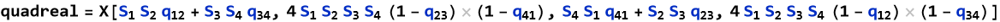

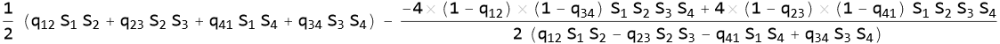

The proof employs the quadratic compatibility theorem. We will show that equations (1) and (2) above are compatible since they meet the criteria for being compatible from the quadratic compatibility theorem.

Perform compatibility check:

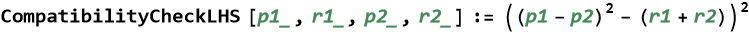

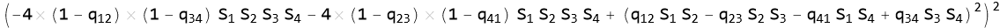

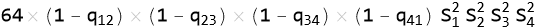

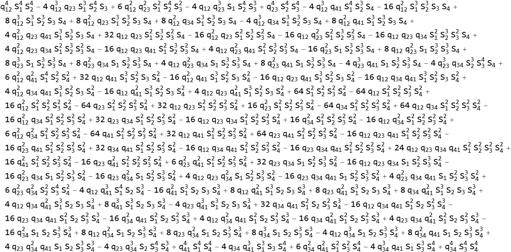

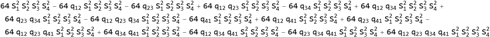

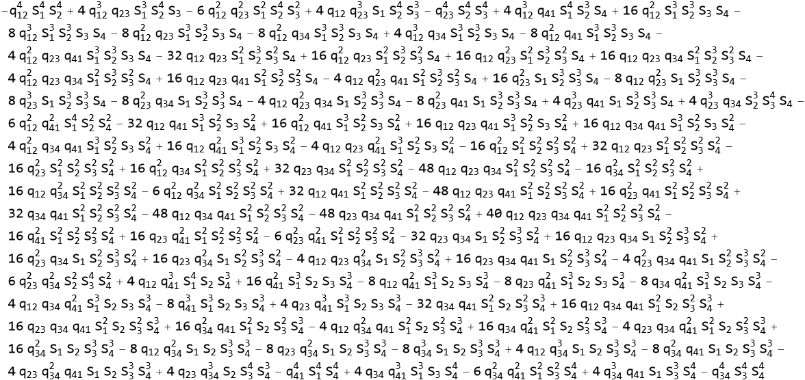

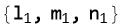

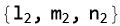

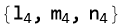

Meet of lines.

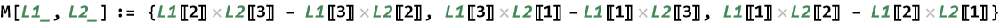

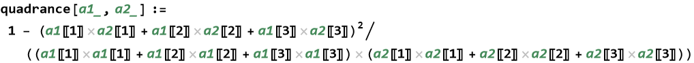

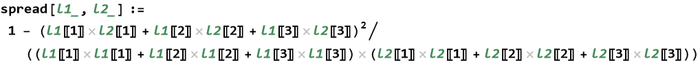

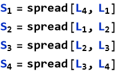

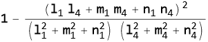

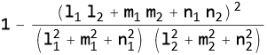

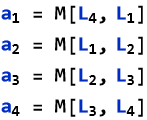

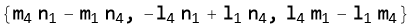

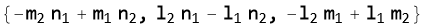

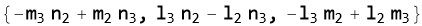

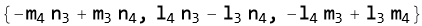

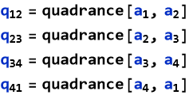

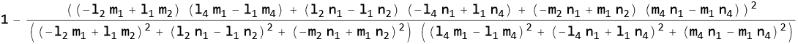

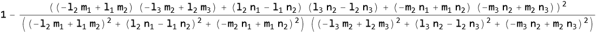

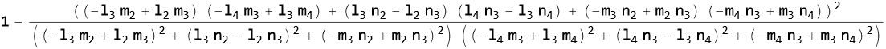

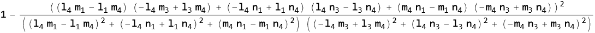

The next cell may take a long time to execute since the q’s and the S’s in the “ArchimedesFn” equation are being substituted with the x’s, y’s and z’s in the q’s and S’s expressions above and the whole thing is being factored. A result of zero indicates that the criteria for compatible equations in the quadratic compatibility theorem has been met.

We have proved that the following two quadratic equations in B are compatible.

[Created with the Wolfram Language](http://www.wolfram.com/language/)